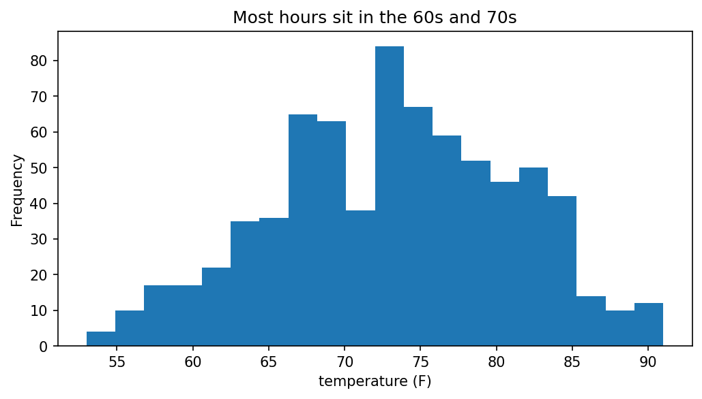
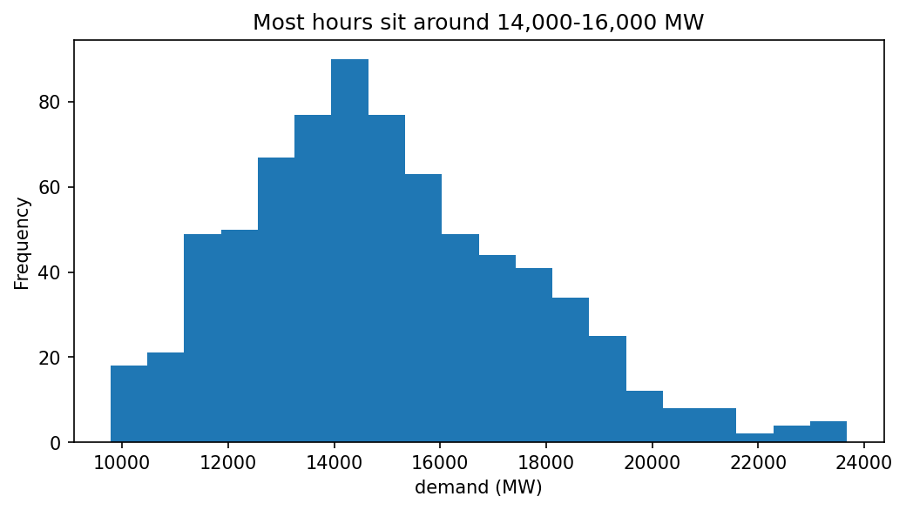

# Weather and our load — Lab 1 report

*Two people, two halves, one repo. Replace every ➜ line with a real sentence. Every number gets a unit.*

## 1. Temperature over the month

➜ Hourly temperature at the Hartford airport ranged from about 55°F to 90°F between Jul 20 and Aug 19, 2026, with a clear daily heating/cooling cycle and a noticeable warm stretch pushing temperatures above 85°F in the final week.

## 2. How often was it hot?

➜ Temperatures topped 85°F in roughly 1 out of every 7-8 hours during the month.

## 3. Demand over the month

➜ From the line plot, demand peaked around early August (roughly Aug 5-7), reaching close to 24,000 MW at the highest points

## 4. How often was the grid working hard?

➜ based on the histogram, most hours cluster between 14,000 and 16,000 MW, with the single biggest bar around 14,000-15,000 MW

## 5. (Optional) Demand vs temperature

➜ One sentence a manager understands: *"each degree above ___ °F adds roughly ___ MW."*

## What this data can't tell us
➜ This data shows the pattern of temperature and demand together, but it doesn't establish that heat caused the demand spikes
